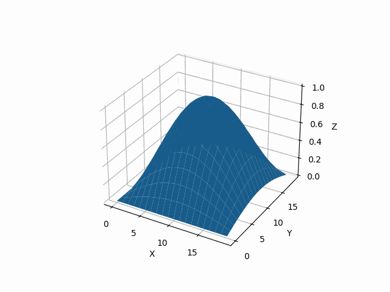

# Oblig - Matematikk 4
### <span style="color:gray">Stener T. Nordnes</span>

Dette skriptet simulerer varmelikningen i 2 dimensjoner på en firkantet plate.

#### Resultat

For å se resultatet av simuleringen, kjør denne kommandoen i terminalen:

```bash
python main.py
```

eller bare se denne videoen:

[](./animation.gif)


## Installering

Klon prosjektet fra GitHub:

```bash
git clone 
```

Last ned avhengigheter:

```bash
pip install -r requirements.txt
```

## Bruk

Kjør simuleringen:

```bash
python main.py
```
